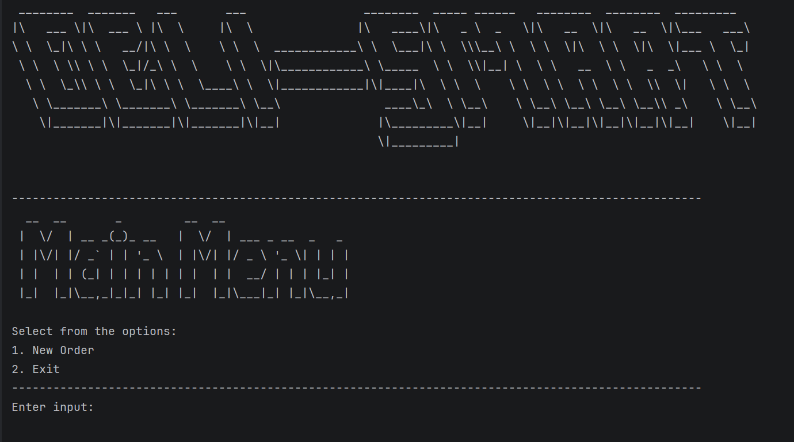
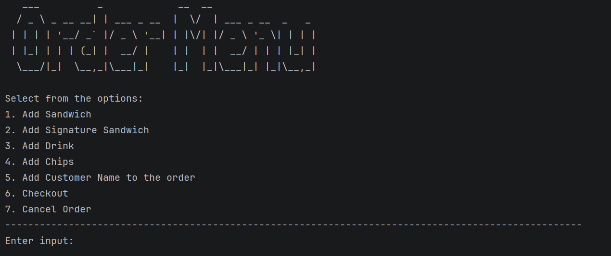
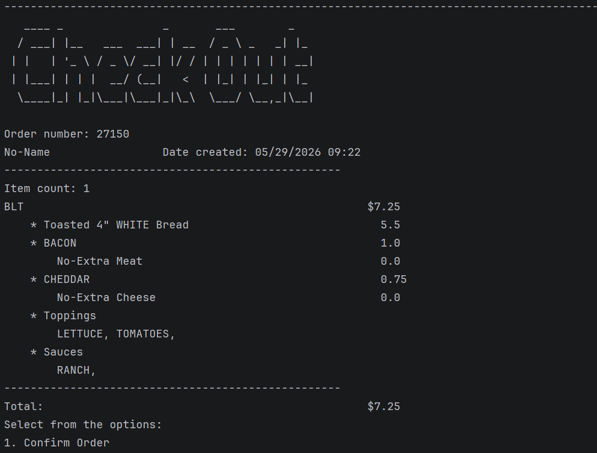
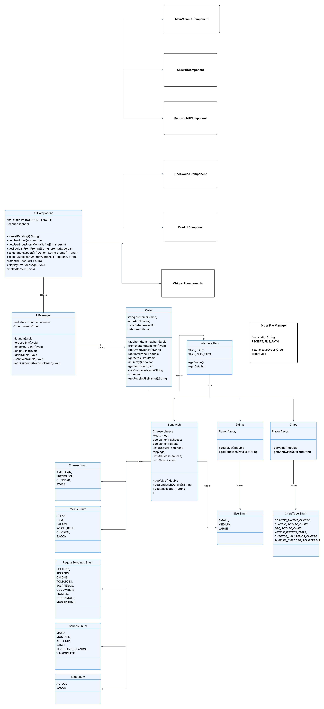

# Capstone 2: DELI-smart POS System

## Project Description

DELI-smart POS System is a Java command-line point-of-sale application created for a custom sandwich shop. The application allows a user to create a new order, add customized sandwiches, add signature sandwiches, add drinks, add chips, review the order, edit or remove items during checkout, and save the completed order as a receipt file.


---

## Features

* Start a new order from the main menu
* Add a custom sandwich
* Choose sandwich size
* Choose bread type
* Choose meat and extra meat
* Choose cheese and extra cheese
* Add regular toppings
* Add sauces
* Choose whether the sandwich is toasted
* Add signature sandwiches
* Add drinks by size
* Add chips by type
* Add a customer name to the order
* View complete order details during checkout
* Edit items before checkout
* Remove items before checkout
* Calculate the full order total
* Save each completed order as a receipt text file
* Generate receipt file names using the order date and time

---

## Technologies Used

* Java 17
* Maven
* IntelliJ IDEA
* Git
* GitHub

---


## Main Menu

When the application starts, the user can choose to:



Selecting **New Order** starts a new customer order. Selecting **Exit** closes the application.

---

## Order Menu

After starting a new order, the user can:



The application continues running until the user chooses to exit from the main menu.

---

## Checkout Section

The checkout section allows the user to confirm the order, edit the order, remove item from the order, and of course confirm the order!



---

## Pricing Summary

### Sandwich Base Prices

| Size    | Price |
| ------- | ----: |
| 4 inch  | $5.50 |
| 8 inch  | $7.00 |
| 12 inch | $8.50 |

### Meat Prices

| Size    |  Meat | Extra Meat |
| ------- | ----: | ---------: |
| 4 inch  | $1.00 |      $0.50 |
| 8 inch  | $2.00 |      $1.00 |
| 12 inch | $3.00 |      $1.50 |

### Cheese Prices

| Size    | Cheese | Extra Cheese |
| ------- | -----: | -----------: |
| 4 inch  |  $0.75 |        $0.30 |
| 8 inch  |  $1.50 |        $0.60 |
| 12 inch |  $2.25 |        $0.90 |

### Other Items

| Item         | Price |
| ------------ | ----: |
| Small Drink  | $2.00 |
| Medium Drink | $2.50 |
| Large Drink  | $3.00 |
| Chips        | $1.50 |

---

## Object-Oriented Design

This project uses Object-Oriented Programming to keep the code organized and maintainable.

### Main Classes

| Class                | Responsibility                                          |
|----------------------| ------------------------------------------------------- |
| `Main`                | Starts the application                                  |
| `UIManager`          | Controls the main program flow                          |
| `UIComponent`        | Provides shared helper methods for UI classes           |
| `Displayable`        | Interface for UI components that can display themselves |
| `Item`               | Abstract parent class for order items                   |
| `Sandwich`           | Represents a custom sandwich                            |
| `SignatureSandwich`  | Represents a pre-built sandwich template                |
| `Drink`              | Represents a drink item                                 |
| `Chips`              | Represents a chips item                                 |
| `Order`              | Stores order items and calculates order totals          |
| `OrderFileManager`   | Saves completed orders as receipt files                 |
| `CheckoutUIComponent` | Handles checkout, editing, removing, and saving orders  |

## UML Diagram



## Receipt Files

Receipts are saved in the following folder:

```text
src/main/resources/Receipts/
```

Each receipt file is named using the date and time the order was created:

```text
yyyyMMdd-HHmmss.txt
```

Example:

```text
20260529-121523.txt
```

---

## Interesting Piece of Code

One interesting part of this project is the reusable enum selection method in `UIComponent`.

Instead of writing repeated menu-selection logic for bread, size, meat, cheese, toppings, sauces, chips, and drinks, the project uses generic helper methods that can display enum values and return the user's selection. This helps reduce repeated code and makes the UI components cleaner.

Another important piece is the `Item` abstraction. Since `Sandwich`, `Drink`, and `Chips` all extend `Item`, the `Order` class can store every item in a single `List<Item>` and calculate the total without needing separate lists for each item type.

---

## Author

**Luis Vasquez**

Capstone 2 - DELI-cious POS System
